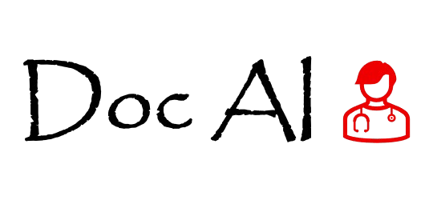

<p align="center">
  
</p>

# Doc-AI Frontend

This is the **frontend** of **Doc-AI**, a web application that provides users with **daily medicine recommendations** and **AI-powered consultations**.  
The app is built with **Next.js**, styled with **Tailwind CSS**, and deployed on **Vercel**.

---

## Project Status

  
_This project is currently under construction. New features and improvements are being added regularly._

---

## Features (Planned & In Progress)

- **Authentication (Login/Signup)** – Users can create accounts and log in securely.  
- **Profile Page** – Collects personal details like name, age, medical history, and medications.  
- **Chat Interface** – Users can interact with an AI bot for health queries.  
- **Medicine Recommendations** – Provides relevant medicine information with **disclaimer warnings**.  
- **Doctor Consultation Warning** – Every recommendation comes with a clear reminder to consult a professional doctor.  

---

## 🛠️ Tech Stack

- **Frontend Framework**: [Next.js](https://nextjs.org/)  
- **Styling**: [Tailwind CSS](https://tailwindcss.com/)  
- **Deployment**: [Vercel](https://vercel.com/)  

---

##  Getting Started

### Prerequisites
- Node.js `>=18.x`
- npm or yarn

### Installation

1. Clone the repository:
   ```bash
   git clone https://github.com/your-username/doc-ai-fe.git
   cd doc-ai-fe
   npm install
   npm run dev
   http://localhost:3000


## Contributing

Contributions are welcome!
Please fork this repo, create a branch, and submit a pull request.

## Disclaimer

This app is not a substitute for professional medical advice.
Always consult a licensed healthcare provider before making medical decisions.

## License

All rights reserved -> Muhammad Hurrairah


